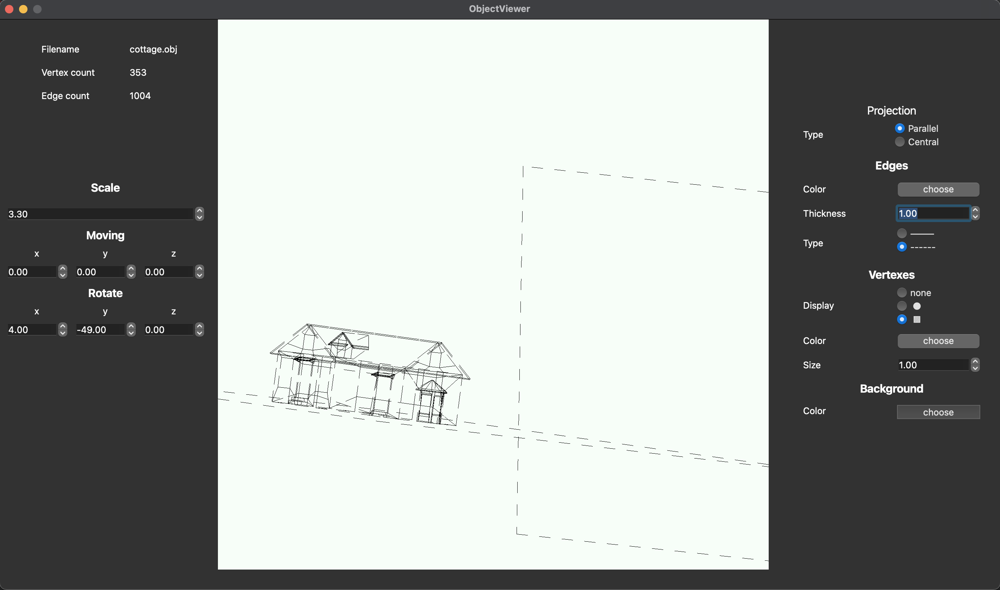

# Object Viewer (QT + OpenGL + C++)

## Overview


## The program allows you to:
- Load a wireframe model from an obj file
- Move the model
- Rotate the mode
- Scale the model
- Change the projection type (parallel and central)
- Customize the type (solid, dotted), the color and thickness of the edges, the display method (missing, circle, square), color and size of vertices
- Choose a background color
- Save settings between program restarts
- Save render as BMP, JPEG
- Save render as GIF (640x480, 10fps, 5s)

## Patterns:
- Facade
- Singleton
- Command (undo/redo)

## OS
- MacOs

## Dependencies
- Qt5
- Qt6
- OpenGL
- cmake
- make

## install
```
make install
``` 

After installation, the application will appear in the desktop folder

## test
For start unit tests use command
```
make test
```